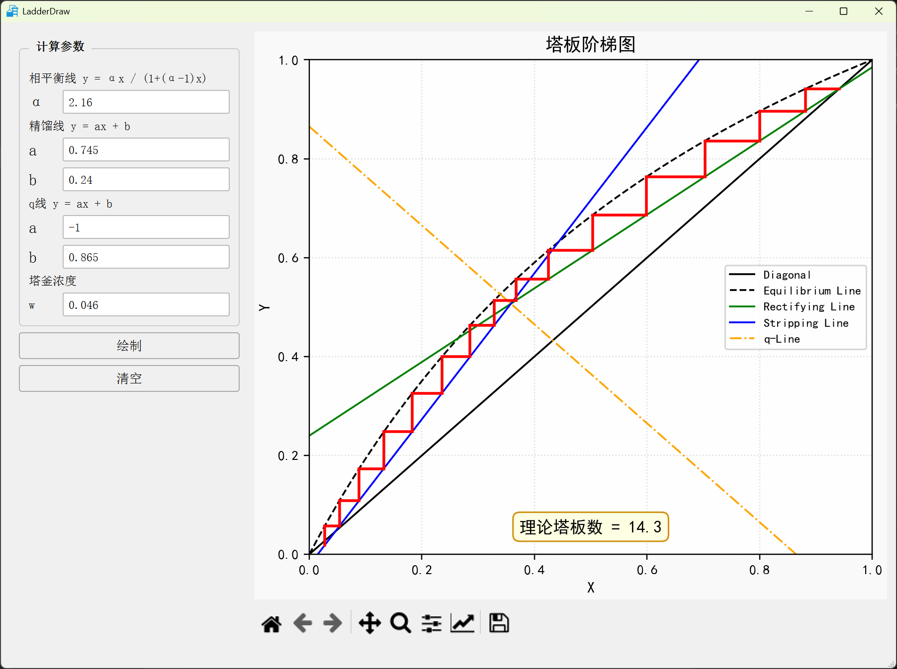

# LadderDraw

LadderDraw是面向化学工程与工艺及相关专业本科生的一个小工具，用于绘制化工原理中常见的精馏塔塔板阶梯图（McCabe-Thiele 图）。



## Get Started

### 安装依赖

```bash
# 创建虚拟环境
python -m venv .venv

# 激活虚拟环境
# Windows:
.venv\Scripts\activate
# macOS / Linux:
source .venv/bin/activate

# 安装依赖
pip install -r requirements.txt
```

### 运行

```bash
python -m ladderdraw
```

### 编程调用（纯计算 API）

计算层 `compute_stages` 不依赖 PyQt，可在脚本 / Jupyter 中直接使用：

```python
from ladderdraw import compute_stages

r = compute_stages(alpha=2.16, rl_a=0.745, rl_b=0.24,
                   ql_a=-1, ql_b=0.865, w=0.046)
print(r.total_stages)   # 14.286
print(r.full_stages)    # 14
print(len(r.steps))     # 15（阶梯几何，可用于自行绘图）
```

### 操作说明

1. 在左侧面板输入 **相平衡线 α**、**精馏线 a/b**、**q 线 a/b** 和 **塔釜浓度 w**
2. 点击 **绘制** 按钮生成阶梯图
3. 图表区支持 matplotlib 工具栏交互（平移、缩放、保存）

## 理论塔板数计算原理

McCabe-Thiele 法中，理论塔板数通过逐级图解法计算：

1. 从塔顶馏出液组成点 (xD, xD) 出发，在平衡线和操作线（精馏线/提馏线）之间交替画水平线和竖直线，形成阶梯
2. 每完成一个 **水平→竖直** 的完整阶梯，计为 **1 块理论塔板**
3. 当最后一段水平线的 x 坐标即将越过塔釜浓度 w 时，按比例计算小数部分：

```
小数部分 = (x_起点 - w) / (x_起点 - x_平衡线交点)
```

其中：

- x_起点 — 最后一个完整阶梯起步时的 x 坐标
- x_平衡线交点 — 该步水平线本应到达的相平衡线 x 坐标
- w — 塔釜浓度

**理论塔板数 = 完整阶梯数 + 小数部分**

例如默认参数下：14 个完整阶梯 + 0.3 部分阶梯 = **14.3 块理论塔板**。

## 项目思路

PyQt5 与 matplotlib 结合，构建桌面应用：

**对象模型：**


### 依赖

- PyQt5
- matplotlib
- sympy
- numpy

### 开发工具

- Python 3
- 手工维护 ui.py（不再使用 Qt Designer）

### 打包为桌面应用

用 PyInstaller 打包（onedir 模式：启动快、杀软误报少），便于分发给未装 Python 的同学：

```bash
pip install pyinstaller
pyinstaller LadderDraw.spec      # 产物：dist/LadderDraw/ 文件夹
```

分发时把 `dist/LadderDraw/` 整个文件夹压成 zip 发给同学，解压后双击其中的 `LadderDraw.exe` 即可。

需要自定义 exe 图标时，把 `.ico` 文件放到 `resources/icons/huagong.ico` 即可生效。

## License

MIT
